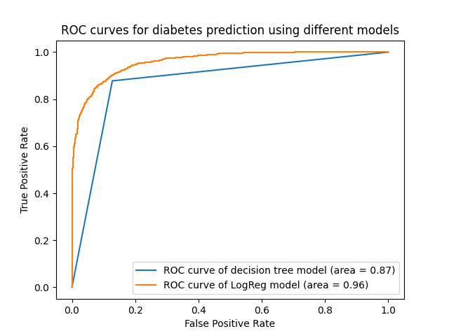

# Diabetes Prediction - Binary Classification

[Click here for the notebook](project.ipynb)

## Problem Statement
The goal of this project is to create and compare Machine Learning models that predict whether or not a patient has diabetes based on their medical information.


## The Dataset
The dataset contains medical data of patients along with their diabetes status.
- `age`: age of the patient
- `gender`: gender of the patient
- `bmi`: body mass index of the patient
- `hypertension`: hypertension status of the patient (chronic condition where the blood pressure is too high)
- `heart_disease`: heart disease status of the patient
- `smoking_history`: smoking history of the patient (never, No Info, current, former, not current, ever)
- `HbA1c_level` - result of glucose level blood test which measures blood sugar level over the past 2-3 months.
- `blood_glucose_level` - blood glucose level of the patient

Note: If I were to re-do this project, I would get the data from a more established source, as the origins of this dataset are unclear.

https://www.kaggle.com/datasets/iammustafatz/diabetes-prediction-dataset

## Data pre-processing

In this section, I notice that 36% of all entries in the dataset have a `smoking_history` value of "No Info". This is not helpful, so I use Mode Category imputation to fix this. I do this by replacing all `smoking_history` values of 'No Info' with the most common value in the patient's age group.

```
# This function takes all entries within an age range as a parameter
# It returns the most common value for 'smoking_history' that is not 'No Info'
def get_mode_smoking_history_from_group(group):
    value_counts = group.value_counts()    
    most_common = value_counts.index[0] if value_counts.index[0] != "No Info" else value_counts.index[1]    
    return most_common

# Group all entries into age_group bins of width 5 (years). 
# Replace all smoking_history values of 'No Info' with the most common value in the respective age group.
df['age_group'] = pd.cut(df['age'], bins=np.arange(0, df["age"].max(), 5), right=False)
df['smoking_history_of_age_group'] = df.groupby('age_group')['smoking_history'].transform(lambda x: get_mode_smoking_history_from_group(x))
df.loc[df['smoking_history'] == 'No Info', 'smoking_history'] = df['smoking_history_of_age_group']

# Check that there are no more counts for 'No Info'
df["smoking_history"].value_counts()
```
I also look at the different values for `gender` and find that these values are `Male`, `Female` and `Other`. There are 18 (out of 100,000) patients with the value `Other` and none of them have a positive diabetes diagnosis, so I chose to drop these entries.

## Exploratory Analysis

In this section, I want to find any correlations between diabetes and the other features.

I start with the categorical features: `smoking_history` and `gender`.


I find that there are higher rates of diabetes in male patients and that patients who were former smokers had almost double the rate of diabetes compared to those who had never smoked.

In order to see the correlation between the numerical features and diabetes, I plot a heatmap.


I find that all of the features have substantial positive correlations with diabetes. The features with the highest correlations are `blood_glucose_level` and `HbA1c_level`. Based on this, I choose to include all the features in the model creation.

When looking at the correlations between features, I do not see large enough correlations to suspect multicollinearity.

## Categorical Feature Encoding

The first thing I did was to turn `gender` into a binary feature, now that the only values were `Male` and `Female`.

I also used one-hot encoding for the `smoking_history` feature.

## Numerical variables normalisation

I scaled the non-binary numerical features so that all the values are between 0 and 1. This ensures that all features are on the same scale, which speeds up convergence when training the models.

## Sampling for a balanced dataset

Only around 8.5% of the instances in the dataset have a positive diagnosis of diabetes.

I balance the dataset to improve model performance. It will also help to evaluate the models more accurately.
```
diabetic = df[df.diabetes == 1] 
not_diabetic = df[df.diabetes == 0] 
n = min([len(diabetic), len(not_diabetic)]) 
diabetic_sample = diabetic.sample(n = n, random_state = 0) 
not_diabetic_sample = not_diabetic.sample(n = n, random_state = 0)
df = pd.concat([diabetic_sample, not_diabetic_sample]) 
```

## Train-test split

I take 20% of the dataset and reserve it for testing the models. I also only take the features in the DataFrame that I need (e.g. I do not include `smoking_history` as I have applied one-hot encoding to it. Instead I include `smoking_history_never`, `smoking_history_current` etc.)

## Logistic Regression

The first model I create is a Logistic Regression model. I then use it to predict the outcome of the test dataset. I get an accuracy score of ~0.88. I then calculate the AUC-ROC score, which is 0.96.

## Decision Tree

Next, I create a Decision Tree model. It has an accuracy score of 0.86 and AUC-ROC score of 0.86.

## Comparison

In order to compare the models, I plot the ROCs on the same graph.



It shows that the logistic regression model has a higher AUC (area under curve) score. We can see that overall, the logistic regression model has a higher True Positive Rate and a lower False Positive Rate. 

Though the accuracies of the models are similar, we can conclude that the logistic regression model would be more effective at predicting whether or not a patient has diabetes.